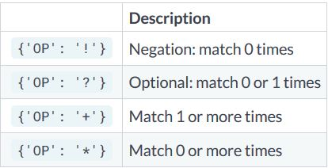
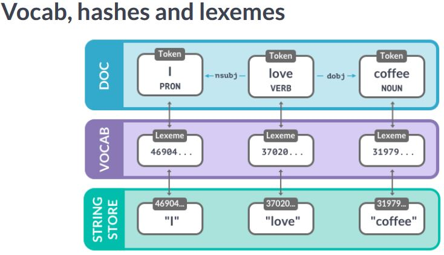

### The nlp object

```python
# import the english language class
from spacy.lang.en import English

# create the nlp object
nlp = English()
```

- we can use the nlp object like a function to analyze text. Contains the preprcoessing pipeline. It also includes language specific rules used for tokenizing the text into words and punctuation.

#### The Doc object
- When we process a text with the nlp object, spacy creates a Doc object - short for "document". 

```python
# created by processing a string of text with the nlp object
doc = nlp("Hello world!")

# iterate over tokens in a doc
for token in doc:
    print(token.text)
    
token = doc[1]

print(token.text)
```

#### The Span object
- A span object is a slice of the document consisting of one or more tokens. It's only a view of the doc and doesn't contain any data itself. To create a span we can use python slicing

```python
# a slice from the Doc is a span object
span = doc[1:4]

print(span.text)
```

#### Lexical attributes

```python
doc = nlp("It costs $5.")

print("Index: ", [token.i for token in doc])
print("Text: ", [token.text for token in doc])
print("is_alpha:", [token.is_alpha for token in doc])
print("is_punct:", [token.is_punct for token in doc])
print("like_num:", [token.like_num for token in doc])
```

### Statistical models
- Enables spacy to predict linguistic attributes in context e.g Part-of-speech tags, syntatic dependencies, named entities trained on labeled example texts.
- `en_core_web_sm` package is a small English model that supports all core capabilities and is trained on web text.

```python
import spacy

nlp = spacy.load('en_core_web_sm')
```

#### Predicting Part-of-speech tags

```python
import spacy

# load the small English model
nlp = spacy.load('en_core_web_sm')

# process the text
doc = nlp("She ate the pizza")

# Iterate over the tokens
for token in doc:
    # print the text and the predicted part-of-speech tag
    print(token.text, token.pos_)
```

- In spacy attributes that returns string ends with an underscore, attributes without the underscore return an ID.

#### Predicting the Syntactic Dependencies
- In addition to the part-of-the-speech tags, we can also predict how the words are related. For example, whether a word is the subject of the sentence or an object.
- Spacy uses a standardized labels scheme.
- The "dep underscore" attribute returns the predicted dependency label.


- The pronoun she is a nominal subject attached to the verb - in this case, to "ate". The noun "pizza" is a direct object attached to the verb "ate". It is eaten by the subject "she".
- The determiner "the", also known as an article, is attached to the noun "pizza".

#### Predicting Named Entities

```python
# process a text
doc = nlp(u"Apple is looking at buying U.K startup for $1 billion")

#iterate over the predicted entities
for ent in doc.ents:
    print(ent.text, ent.label_)
```

#### The explain method
- To get definitions for the most common tags and labels.

```python
spacy.explain("GPE")
spacy.explain("NER")
spacy.explain("dobj")
```

### Rule based matching

#### Why not regular expressions
- Spacy's matcher let's us write rules to find words and phrases in text. Compared to regular expressions, the matcher workds with DOc and token objects instead of only strings.
- It's also more flexibe : we can search for texts but also other lexical attributes.
- We can even write rules that use the model's predictions. For example, find the word "duck" only if it's a verb, not a noun.

#### Match patterns
- Match patterns are lists of dictionaries. Each dictionary describes one token. The keys are the names of the token attributes, mapped to their expected values.
- E.g `[{'ORTH':'iPhone'}, {'ORTH':'X'}]` . In this example, we're looking for two tokens with the text "iPhone" and "X". We can also match on other token attributes.
- E.g `[{'LOWER':'iphone'}, {'LOWER':'x'}]`. Here, we're looking for two tokens whose lowercase forms equal "iphone" and "x".
- We can even write patterns using attributes predicted by the model. `[{'LEMMA':'buy'}, {'POS':'NOUN'}]` . Here we are matching a token with the lemma "buy", plus a noun. The lemma is the base form, so the pattern would match phrases like "buying milk" or "bought flowers".

#### Using the Matcher

```python
import spacy

# import the matcher
from spacy.matcher import Matcher

# load the model and create the nlp object
nlp = spacy.load('en_core_web_sm')

# initialize the matcher with the shared vocab
matcher = Matcher(nlp.vocab)

# add pattern to the matcher
pattern = [{'ORTH':'iPhone'}, {'ORTH':'X'}]

# the first argument is a unique ID to identify which pattern was matched,
# second argument is an optional callback, we don't need here so we set it to None
# third argument is the pattern
matcher.add('IPHONE_PATTERN', None, pattern)

# process some text
doc = nlp("New iPhone X release date leaked")

# call the matcher on the doc, it returns a list of tuples 
matches = matcher(doc)

# each tuple consists of 3 values : the match ID, the start index and the end index of the matched span
# match_id : hash value of the pattern name
# start : start index of matched span
# end : end index of matched span
# iterate over the matches
for match_id, start, end in matches:
    # get the matched span
    matched_span = doc[start:end]
    print(matched_span.text)
```

#### Matching lexical attributes
- 5 tokens consisting of only digits. Three case-insensitive tokens for 'fifa', 'world' and 'cup' and a token that consists of punctuation. The pattern matches the token `"2018 FIFA World Cup:"`

```python
pattern = [{"IS_DIGIT":True}, {"LOWER":'fifa'}, {"LOWER":"world"}, {"LOWER":"cup"},
            {"IS_PUNCT":True}]
doc = nlp("2018 FIFA World Cup : France won!")
```

#### Matching other token attributes

```python
pattern = [{'LEMMA':'love', 'POS':'VERB'}, {'POS':'NOUN'}]

doc = nlp("I loved dogs but the now I love cats more")
```

- Here we have 2 tokens. A verb with the lemma "love", followed by a noun. This pattern matches "loved dogs" and "love cats".

#### Using operators and quantifiers

```python
pattern = [{'LEMMA':'buy'},
           {'POS':'DET', 'OP':'?'}, # optional : match 0 or 1 times
           {'POS':'NOUN'}]
doc = nlp("I bought a smartphone. Now I'm buying apps.")
```

- Operators and quantifiers lets us define how often a token should be matched. They can be added using the 'OP' key. Here the "?" operator makes the determiner token optional, so it will match a token with the lemma "buy", an optional article and a noun.
- "OP" can have one of the four values:



### Data Structures : Vocab, Lexemes and StringStore

#### Shared vocab and string store
- spacy stores all shared data in a vocabulary, the Vocab. This includes words, but also the labels schemes for tags and entities. To save memory, all strings are encoded to hash IDs.
- If a word occurs more than once, we don't need to save it every time. Instead, spacy uses a hash function to generate an ID and stores the string only once in the string store. The `StringStore` is available as `nlp.vocab.strings`.
- **StringStore** : It's a lookup table that works in both directions. We can look up a string and get its hash, and look up a hash to get its string value. Internally, spacy only communicates in hash IDs.

```python
coffee_hash = nlp.vocab.strings['coffee']
coffee_string = nlp.vocab.strings[coffee_hash]
```

- Hashes can't be reversed. If a word is not in the vocabulary, there's no way to get its string. That's why we need to provide the shared vocab. To get the hash for a string, we can look it up in `nlp.vacab.strings`

```python
# raises an error if we haven't seen the string before
string = nlp.vocab.strings[3197928453018144401]
```

- To get a string representation of a hash, we can look up the hash.

```python
doc = nlp("I love coffee")
print("hash value:", nlp.vocab.strings['coffee'])
print("string value:", nlp.vocab.strings[319728293923])
```

- the `doc` object also exposes the vocab and strings

```python
doc = nlp("I love coffee")
print("Hash value:", doc.vocab.strings['coffee'])
```

#### Lexemes : entries in the vocabulary
- Lexemes are context-independent entries in the vocabulary. We can get a lexeme by looking up a string or a hash ID in the vocab. 
- Lexemes expose attributes just like tokens. They hold context-independent information about a word, like the text or whether the word consists of alphanumeric characters.
- Lexemes don't have part-of-speech tags, dependencies or entity labels. Those depend on the context.

```python
doc = nlp("I love coffee")
lexeme = nlp.vocab['coffee']

# print the lexial attribute
print(lexeme.text, lexeme.orth, lexeme.is_alpha)
```



- The Doc contains words in context - in this case, the tokens "I", "love" and "coffee" with their part-of-speech tags and dependencies. Each token refers to a lexeme, which knows the  word's hash ID.
- To get the string representation of the word, spacy looks up the hash in the string store.

### Doc, Span and Token
- Most important datastructure : the Doc, and its views Token and Span.

#### The Doc object
- The Doc is one of the central data structures in spacy. It's created automatically when we process a text with the nlp object. But we can also instantiate the class manually.
- After creating the nlp object, we can import the Doc class from `spacy.tokens`. Here we are creating a Doc from three words.
- The Doc class takes 3 arguments : the shared vocab, the words and the spaces

```python
# create an nlp object
from spacy.lang.en import English
nlp = English()

# import the Doc class
from spacy.tokens import Doc

# the words and spaces to create the doc from
words = ['Hello', 'world', '!']
spaces = [True, False, False]

# create a doc manually
doc = Doc(nlp.vocab, words=words, spaces=spaces)
```

#### The Span object
- A span is a slice of a Doc consisting of one or more tokens.The Span takes at least 3 arguments : the doc it refers to, and the start and end index of the span. The end index is exclusive.
- The doc ents are writable, so we can add entries manually by overwriting it with a list of spans.

```python
from spacy.tokens import Doc, Span

# the words and spaces to create the doc from
words = ['Hello', 'world', '!']
spaces = [True, False, False]

# create a doc manually
doc = Doc(nlp.vocab, words=words, spaces=spaces)

# create a span manually
span = Span(doc, 0, 2)

# create a span with label
span_with_label = Span(doc, 0, 2, label="GREETING")

# add span to the doc.ents
doc.ents = [span_with_label]
```

#### Best practices
- The Doc and Span are very powerful and optimized for performance. They give us access to all references and relationships of the words and sentences.
- If the application needs to output strings, make sure to convert the doc as late as possible. If we do it too early, we'll loose all relationship between the tokens.
- To keep things consistent, use the built-in attributes wherever possible. For example `token.i` for the token index.
- Don't forget to pass in the shared `vocab`.


### The training loop
- While some other libraries gives us one method that takes care of training a model, spacy gives us full control over the training loop.

#### The steps of a training loop
1. The training loop is a series of steps that's performed to train or update a model. We usually need to perform it several times, for multiple iterations, so that the model can learn from it effectively.
2. If we want to train for 10 iterations we need to loop 10 times. To prevent the model from getting stuck in a suboptimal solution, we randomly shuffle the data for each iteration. This is a very common strategy when doing stochastic gradient descent.
3. Next we divide the training data into batches of several examples, also known as minibatching. This makes it easier to make a more accurate estimate of the gradient.
4. Finally, we update the model for each batch, and start the loop again until we've reached the last iteration.
5. We can then save the model to a directory and use it in spacy.

#### Recap
- The training data are the examples we want to update our model with. The text should be a sentence, paragraph or a longer document. For best results, it should be similar to what the model will see at runtime.
- The label is what we want the model to predict. This can be a text category, or an entity span and its type.
- The gradient is how we should change the model to reduce the current error. It's computed when we compare the predicted label to the true label.

#### Code

```python
TRAINING_DATA = [("How to preorder the iPhone X", {'entities':[(20, 28, 'GADGET')]}) # and many more examples ..... ]

# loop for 10 iterations
for i in range(10):
    # shuffle the training data
    random.shuffle(TRAINING_DATA)
    
    # use spacy's minibatch utility function to divide the examples into batches
    # for each batch, we get the texts and annotations and call the nlp update method to update the model
    # create batches and iterate over them
    for batch in spacy.util.minibatch(TRAINING_DATA):
        # split the batch in texts and annotations
        texts = [text for text, annotation in batch]
        annotations = [annotation for text, annotation in batch]
        
        # update the model
        nlp.update(texts, annotations)

# save the model
save.to_disk()
```

#### Updating an existing model
- spacy lets us update an existing pre-trained model with more data for example, to improve its predicitons on different axis. This is especially useful if we want to improve categories the model already knows like "person" or "organization".
- We can also update the model to add new categories. But be careful and make sure the model doesn't "forget" the old ones.

#### Setting up a new pipeline from scratch
- The blank model doesn't have any pipeline components, only the language data and tokenization rules.
- Call `nlp.begin_training()` to initialize the model with random weights

```python
# start with a blank english model
nlp = spacy.blank('en')

# create a blank entity recognizer and add it to the pipeline
ner = nlp.create_pipe('ner')
nlp.add_pipe(ner)

# using the "add label" method, we can add new string labels to the model
ner.add_label("GADGET")

# start the training
nlp.begin_training()

# train for 10 iterations
for itn in range(10):
    random.shuffle(examples)
    
    # divide the examples into batches
    for batch in spacy.util.minibatch(examples, size=2):
        texts = [text for text, annotation in batch]
        annotations = [annotation for text, annotation in batch]
        
        # update the model
        nlp.update(texts, annotation)
```


        
        
        
        
        
        
        
        
        
        
        
        


          
          
          
          
          
          
          
          
          
          
          
          
          
          
          
          
          
          


    
    


```python

```
