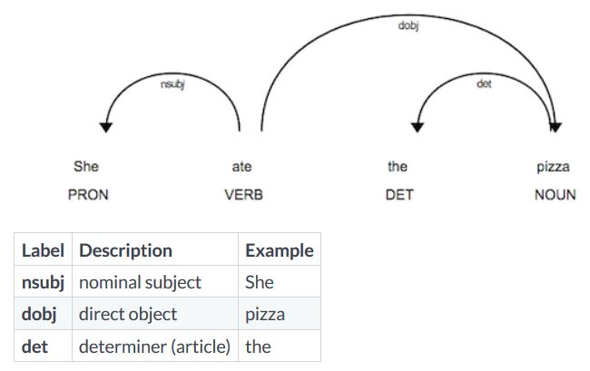

### The nlp object

```python
# import the english language class
from spacy.lang.en import English

# create the nlp object
nlp = English()
```

- we can use the nlp object like a function to analyze text. Contains the preprcoessing pipeline. It also includes language specific rules used for tokenizing the text into words and punctuation.

#### The Doc object
- When we process a text with the nlp object, spacy creates a Doc object - short for "document". 

```python
# created by processing a string of text with the nlp object
doc = nlp("Hello world!")

# iterate over tokens in a doc
for token in doc:
    print(token.text)
    
token = doc[1]

print(token.text)
```

#### The Span object
- A span object is a slice of the document consisting of one or more tokens. It's only a view of the doc and doesn't contain any data itself. To create a span we can use python slicing

```python
# a slice from the Doc is a span object
span = doc[1:4]

print(span.text)
```

#### Lexical attributes

```python
doc = nlp("It costs $5.")

print("Index: ", [token.i for token in doc])
print("Text: ", [token.text for token in doc])
print("is_alpha:", [token.is_alpha for token in doc])
print("is_punct:", [token.is_punct for token in doc])
print("like_num:", [token.like_num for token in doc])
```

### Statistical models
- Enables spacy to predict linguistic attributes in context e.g Part-of-speech tags, syntatic dependencies, named entities trained on labeled example texts.
- `en_core_web_sm` package is a small English model that supports all core capabilities and is trained on web text.

```python
import spacy

nlp = spacy.load('en_core_web_sm')
```

#### Predicting Part-of-speech tags

```python
import spacy

# load the small English model
nlp = spacy.load('en_core_web_sm')

# process the text
doc = nlp("She ate the pizza")

# Iterate over the tokens
for token in doc:
    # print the text and the predicted part-of-speech tag
    print(token.text, token.pos_)
```

- In spacy attributes that returns string ends with an underscore, attributes without the underscore return an ID.

#### Predicting the Syntactic Dependencies
- In addition to the part-of-the-speech tags, we can also predict how the words are related. For example, whether a word is the subject of the sentence or an object.
- Spacy uses a standardized labels scheme.
- The "dep underscore" attribute returns the predicted dependency label.



- The pronoun she is a nominal subject attached to the verb - in this case, to "ate". The noun "pizza" is a direct object attached to the verb "ate". It is eaten by the subject "she".
- The determiner "the", also known as an article, is attached to the noun "pizza".

#### Predicting Named Entities

```python
# process a text
doc = nlp(u"Apple is looking at buying U.K startup for $1 billion")

#iterate over the predicted entities
for ent in doc.ents:
    print(ent.text, ent.label_)
```

#### The explain method
- To get definitions for the most common tags and labels.

```python
spacy.explain("GPE")
spacy.explain("NER")
spacy.explain("dobj")
```


          
          
          
          
          
          
          
          
          
          
          
          
          
          
          
          
          
          


    
    


```python

```
