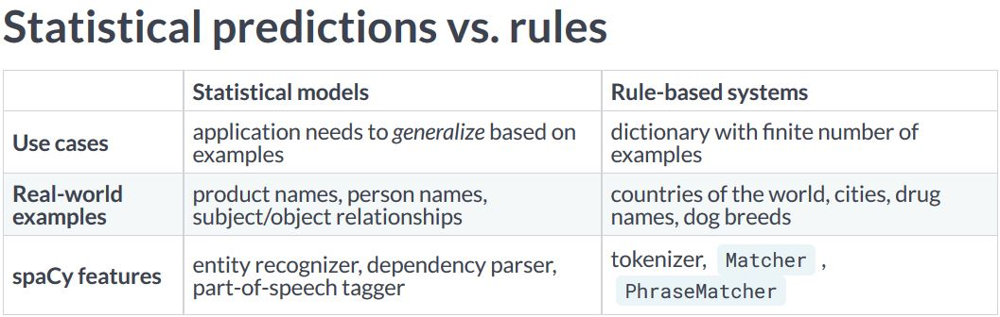
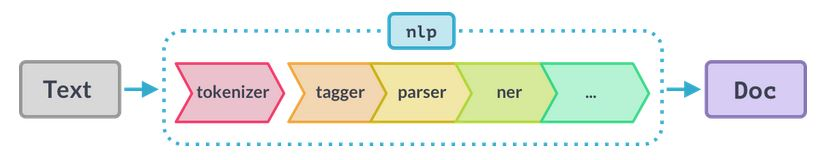
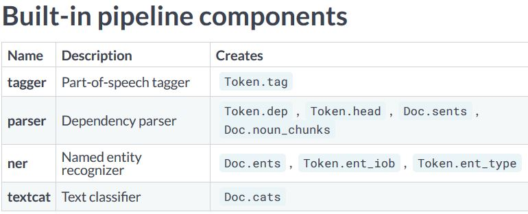
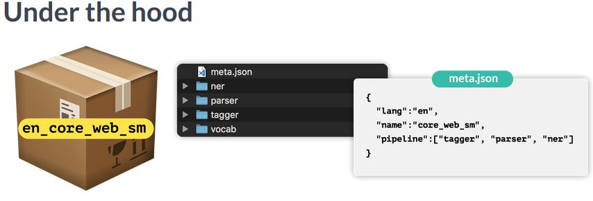
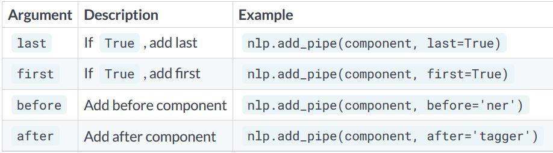

### The nlp object

```python
# import the english language class
from spacy.lang.en import English

# create the nlp object
nlp = English()
```

- we can use the nlp object like a function to analyze text. Contains the preprcoessing pipeline. It also includes language specific rules used for tokenizing the text into words and punctuation.

#### The Doc object
- When we process a text with the nlp object, spacy creates a Doc object - short for "document". 

```python
# created by processing a string of text with the nlp object
doc = nlp("Hello world!")

# iterate over tokens in a doc
for token in doc:
    print(token.text)
    
token = doc[1]

print(token.text)
```

#### The Span object
- A span object is a slice of the document consisting of one or more tokens. It's only a view of the doc and doesn't contain any data itself. To create a span we can use python slicing

```python
# a slice from the Doc is a span object
span = doc[1:4]

print(span.text)
```

#### Lexical attributes

```python
doc = nlp("It costs $5.")

print("Index: ", [token.i for token in doc])
print("Text: ", [token.text for token in doc])
print("is_alpha:", [token.is_alpha for token in doc])
print("is_punct:", [token.is_punct for token in doc])
print("like_num:", [token.like_num for token in doc])
```

### Statistical models
- Enables spacy to predict linguistic attributes in context e.g Part-of-speech tags, syntatic dependencies, named entities trained on labeled example texts.
- `en_core_web_sm` package is a small English model that supports all core capabilities and is trained on web text.

```python
import spacy

nlp = spacy.load('en_core_web_sm')
```

#### Predicting Part-of-speech tags

```python
import spacy

# load the small English model
nlp = spacy.load('en_core_web_sm')

# process the text
doc = nlp("She ate the pizza")

# Iterate over the tokens
for token in doc:
    # print the text and the predicted part-of-speech tag
    print(token.text, token.pos_)
```

- In spacy attributes that returns string ends with an underscore, attributes without the underscore return an ID.

#### Predicting the Syntactic Dependencies
- In addition to the part-of-the-speech tags, we can also predict how the words are related. For example, whether a word is the subject of the sentence or an object.
- Spacy uses a standardized labels scheme.
- The "dep underscore" attribute returns the predicted dependency label.


- The pronoun she is a nominal subject attached to the verb - in this case, to "ate". The noun "pizza" is a direct object attached to the verb "ate". It is eaten by the subject "she".
- The determiner "the", also known as an article, is attached to the noun "pizza".

#### Predicting Named Entities

```python
# process a text
doc = nlp(u"Apple is looking at buying U.K startup for $1 billion")

#iterate over the predicted entities
for ent in doc.ents:
    print(ent.text, ent.label_)
```

#### The explain method
- To get definitions for the most common tags and labels.

```python
spacy.explain("GPE")
spacy.explain("NER")
spacy.explain("dobj")
```

### Rule based matching

#### Why not regular expressions
- Spacy's matcher let's us write rules to find words and phrases in text. Compared to regular expressions, the matcher workds with DOc and token objects instead of only strings.
- It's also more flexibe : we can search for texts but also other lexical attributes.
- We can even write rules that use the model's predictions. For example, find the word "duck" only if it's a verb, not a noun.

#### Match patterns
- Match patterns are lists of dictionaries. Each dictionary describes one token. The keys are the names of the token attributes, mapped to their expected values.
- E.g `[{'ORTH':'iPhone'}, {'ORTH':'X'}]` . In this example, we're looking for two tokens with the text "iPhone" and "X". We can also match on other token attributes.
- E.g `[{'LOWER':'iphone'}, {'LOWER':'x'}]`. Here, we're looking for two tokens whose lowercase forms equal "iphone" and "x".
- We can even write patterns using attributes predicted by the model. `[{'LEMMA':'buy'}, {'POS':'NOUN'}]` . Here we are matching a token with the lemma "buy", plus a noun. The lemma is the base form, so the pattern would match phrases like "buying milk" or "bought flowers".

#### Using the Matcher

```python
import spacy

# import the matcher
from spacy.matcher import Matcher

# load the model and create the nlp object
nlp = spacy.load('en_core_web_sm')

# initialize the matcher with the shared vocab
matcher = Matcher(nlp.vocab)

# add pattern to the matcher
pattern = [{'ORTH':'iPhone'}, {'ORTH':'X'}]

# the first argument is a unique ID to identify which pattern was matched,
# second argument is an optional callback, we don't need here so we set it to None
# third argument is the pattern
matcher.add('IPHONE_PATTERN', None, pattern)

# process some text
doc = nlp("New iPhone X release date leaked")

# call the matcher on the doc, it returns a list of tuples 
matches = matcher(doc)

# each tuple consists of 3 values : the match ID, the start index and the end index of the matched span
# match_id : hash value of the pattern name
# start : start index of matched span
# end : end index of matched span
# iterate over the matches
for match_id, start, end in matches:
    # get the matched span
    matched_span = doc[start:end]
    print(matched_span.text)
```

#### Matching lexical attributes
- 5 tokens consisting of only digits. Three case-insensitive tokens for 'fifa', 'world' and 'cup' and a token that consists of punctuation. The pattern matches the token `"2018 FIFA World Cup:"`

```python
pattern = [{"IS_DIGIT":True}, {"LOWER":'fifa'}, {"LOWER":"world"}, {"LOWER":"cup"},
            {"IS_PUNCT":True}]
doc = nlp("2018 FIFA World Cup : France won!")
```

#### Matching other token attributes

```python
pattern = [{'LEMMA':'love', 'POS':'VERB'}, {'POS':'NOUN'}]

doc = nlp("I loved dogs but the now I love cats more")
```

- Here we have 2 tokens. A verb with the lemma "love", followed by a noun. This pattern matches "loved dogs" and "love cats".

#### Using operators and quantifiers

```python
pattern = [{'LEMMA':'buy'},
           {'POS':'DET', 'OP':'?'}, # optional : match 0 or 1 times
           {'POS':'NOUN'}]
doc = nlp("I bought a smartphone. Now I'm buying apps.")
```

- Operators and quantifiers lets us define how often a token should be matched. They can be added using the 'OP' key. Here the "?" operator makes the determiner token optional, so it will match a token with the lemma "buy", an optional article and a noun.
- "OP" can have one of the four values:


### Data Structures : Vocab, Lexemes and StringStore

#### Shared vocab and string store
- spacy stores all shared data in a vocabulary, the Vocab. This includes words, but also the labels schemes for tags and entities. To save memory, all strings are encoded to hash IDs.
- If a word occurs more than once, we don't need to save it every time. Instead, spacy uses a hash function to generate an ID and stores the string only once in the string store. The `StringStore` is available as `nlp.vocab.strings`.
- **StringStore** : It's a lookup table that works in both directions. We can look up a string and get its hash, and look up a hash to get its string value. Internally, spacy only communicates in hash IDs.

```python
coffee_hash = nlp.vocab.strings['coffee']
coffee_string = nlp.vocab.strings[coffee_hash]
```

- Hashes can't be reversed. If a word is not in the vocabulary, there's no way to get its string. That's why we need to provide the shared vocab. To get the hash for a string, we can look it up in `nlp.vacab.strings`

```python
# raises an error if we haven't seen the string before
string = nlp.vocab.strings[3197928453018144401]
```

- To get a string representation of a hash, we can look up the hash.

```python
doc = nlp("I love coffee")
print("hash value:", nlp.vocab.strings['coffee'])
print("string value:", nlp.vocab.strings[319728293923])
```

- the `doc` object also exposes the vocab and strings

```python
doc = nlp("I love coffee")
print("Hash value:", doc.vocab.strings['coffee'])
```

#### Lexemes : entries in the vocabulary
- Lexemes are context-independent entries in the vocabulary. We can get a lexeme by looking up a string or a hash ID in the vocab. 
- Lexemes expose attributes just like tokens. They hold context-independent information about a word, like the text or whether the word consists of alphanumeric characters.
- Lexemes don't have part-of-speech tags, dependencies or entity labels. Those depend on the context.

```python
doc = nlp("I love coffee")
lexeme = nlp.vocab['coffee']

# print the lexial attribute
print(lexeme.text, lexeme.orth, lexeme.is_alpha)
```


- The Doc contains words in context - in this case, the tokens "I", "love" and "coffee" with their part-of-speech tags and dependencies. Each token refers to a lexeme, which knows the  word's hash ID.
- To get the string representation of the word, spacy looks up the hash in the string store.

### Doc, Span and Token
- Most important datastructure : the Doc, and its views Token and Span.

#### The Doc object
- The Doc is one of the central data structures in spacy. It's created automatically when we process a text with the nlp object. But we can also instantiate the class manually.
- After creating the nlp object, we can import the Doc class from `spacy.tokens`. Here we are creating a Doc from three words.
- The Doc class takes 3 arguments : the shared vocab, the words and the spaces

```python
# create an nlp object
from spacy.lang.en import English
nlp = English()

# import the Doc class
from spacy.tokens import Doc

# the words and spaces to create the doc from
words = ['Hello', 'world', '!']
spaces = [True, False, False]

# create a doc manually
doc = Doc(nlp.vocab, words=words, spaces=spaces)
```

#### The Span object
- A span is a slice of a Doc consisting of one or more tokens.The Span takes at least 3 arguments : the doc it refers to, and the start and end index of the span. The end index is exclusive.
- The doc ents are writable, so we can add entries manually by overwriting it with a list of spans.

```python
from spacy.tokens import Doc, Span

# the words and spaces to create the doc from
words = ['Hello', 'world', '!']
spaces = [True, False, False]

# create a doc manually
doc = Doc(nlp.vocab, words=words, spaces=spaces)

# create a span manually
span = Span(doc, 0, 2)

# create a span with label
span_with_label = Span(doc, 0, 2, label="GREETING")

# add span to the doc.ents
doc.ents = [span_with_label]
```

#### Best practices
- The Doc and Span are very powerful and optimized for performance. They give us access to all references and relationships of the words and sentences.
- If the application needs to output strings, make sure to convert the doc as late as possible. If we do it too early, we'll loose all relationship between the tokens.
- To keep things consistent, use the built-in attributes wherever possible. For example `token.i` for the token index.
- Don't forget to pass in the shared `vocab`.

### Word Vectors and semantic similarity
- Use spacy to predict how similar documents, spans or tokens are to each other. Spacy can compare two objects and predict how similar they are - for example, documents, spans or single tokens.
- The `Doc, Token and Span` objects have a `.similarity()` method that takes another object and returns a floating point number between 0 and 1, indicating how similar they are.
- Inorder to use similarity, we need a larger spacy model that has word vectors included. For e.g the medium or large English model - but not the small one.
- `en_core_web_md (medium model) , en_core_web_lg (large model), en_core_web_sm (small model)`. So if we want to use vectors, always use a model that ends in "md" or "lg".

#### Similarity example

```python
# load the medium English model with vectors
nlp = spacy.load("en_core_web_md")

# compare two documents
doc1 = nlp("I like fast food")
doc2 = nlp("I like pizza")

print(doc1.similarity(doc2))

# compare two tokens
doc = nlp(" I like pizza and pasta")

token1 = doc[2]
token2 = doc[4]

print(token1.similarity(token2))

# we can also use the similarity method to compare different tyes of objects
# e.g a document and a token

doc = nlp("I like pizza")
token = nlp("soap")[0]

print(doc.similarity(token))

# compare a span with a document
span = nlp("I like pizza and pasta")[2:5]
doc = nlp("Mcdonalds sells burgers")

print(span.similarity(doc))
```

#### How does spacy predict similarity?
- Similarity is determined using word vectors, multi-dimensional representations of meanings of words. Vectors can be added to spacy's statistical models.
- By default, the similarity returned by spacy is the cosine similarity between two vectors.
- Doc and Span vectors default to the average of their token vectors. Short phrases are better than long documents with many irrelevant words. That's why we usually get more value out of shorter phrases with fewer irrelevant words.

#### Word vectors in spacy
- First, we load the medium model again which ships with word vectors.

```python
# load a larger model with vectors
nlp = spacy.load('en_core_web_md')
doc = nlp("I have a banana")

# access the vector via the token.vector attribute.
print(doc[3].vector)

# result is a 300-dimensional vector of the word banana
```

#### Similarity depends on the application context
- Similarity can be used for many applications: recommendation systems, flagging duplicates etc.
- It's important to keep in mind that there's no objective definition of what's similar and what is'nt. It always depends on the context and what the application needs to do.
- Example : spacy's default word vectors assign a very high similarity score to "I like cats" and "I hate cats". This makes sense, because both texts express sentiment about cats. But in a different application context, we might want to consider the phrases as very dissimilar, because they talk about opposite sentiments.

#### Combining model and rules
- Combining statistical models with rule-based systems is one of the most powerful tricks we should have in our NLP toolbox.



#### Recap : Rule based Matching
- Use spacy's rule-based Matcher to find complex patterns in our texts.

```python
from spacy.matcher import Matcher
matcher = Matcher(nlp.vocab)

# patterns are list of dictionaries describing the tokens
pattern = [{'LEMMA':'love', 'POS':'VERB'}, {'LOWER':'cats'}]
# patterns can be added to the matcher using the matcher.add
matcher.add('LOVE_CATS', None,pattern)

# operators can specify how often a token should be matched
# '+' would match one or more times
pattern = [{'TEXT':'very', 'OP':'+'}, {'TEXT':'happy'}]

# calling matcher on doc object returns list of matches (match_id, start, end) tuples
doc = nlp("I love cats and I'm very very happy")
matches = matcher(doc)
```

#### Adding statistical predictions

```python
matcher = Matcher(nlp.vocab)
matcher.add('DOG', None, [{'LOWER':'golden'}, {'LOWER':'retriever'}])
doc = nlp('I have a Golden Retriever')

for match_id, start, end in matcher(doc):
    span = doc[start:end]
    print("Matched span:", span.text)
    # get the span's root token and root head token
    print("Root token:", span.root.text)
    print("Root head token:", span.root.head.text)
    # get the previous token and its POS tag
    print('Previous token:', doc[start-1].text, doc[start-1].pos_)
```

- If the span consists of more than one token, this will be the token that decides the category of the phrase. For e.g the root of "Golden Retriever" is "Retriever". We can also find the head token of the root. This is the synatic "parent" that governs the phrase - in this case, the verb "have".
- We can also look at the previous token and its attributes. In this case, it's a determiner, the article "a".

#### Efficient phrase matching
- The phrase matcher is another helpful tool to find sequences of words in our data. If performs the keyword search on the document, but instead of only finding strings, it gives us direct access to the tokens in context. (**PhraseMatcher** is like regular expressions or keyword search - but with access to the tokens!)
- It takes Doc objects as patterns. More efficient and faster than the **Matcher**. This makes it very useful for matching large dictionaries and word lists on large volumnes of text.

```python
from spacy.matcher import PhraseMatcher

matcher = PhraseMatcher(nlp.vocab)

# instead of list of dicts, we pass doc object as the pattern
pattern = nlp("Golden Retriever")
matcher.add('DOG', None, pattern)
doc = nlp("I have a Golden Retriever")

# iterate over the matches
for match_id, start, end in matcher(doc):
    # get the matched span
    span = doc[start:end]
    print("Matched span:", span.text)
```

- This let's us create a Span object for the matched tokens "Golden Retriever" to analyze it in context.

### Preprocessing pipelines
- Preprocessing pipelines : a series of functions applied to a Doc to add attributes like part-of-speech tags, dependency labels or named entities.

#### What happens when we call nlp ?

```python
doc = nlp("This is a sentence")
```



1. First the tokenizer is applied to turn the string of text into a Doc object.
2. Next a series of pipeline components is applied to the Doc in order. The tagger, then the parser, then the entity recognizer.
3. Finally, the processed Doc is returned, so we can work with it.



- The text classifier sets category labels that apply to the whole text, and adds them to the doc.cats property. Because text categories are always very specific, the text classifier is not included in any of the pre-trained models by default. But we can use it to train our own system.

#### Under the hood



- All models we can load into spacy include several files and a meta JSON. The meta defines things like the language and pipeline.

#### Pipeline attributes

```python
print(nlp.pipe_names)  # list of pipeline component names

print(nlp.pipeline)   # list of (name, compenent) tuples
```

### Custom pipeline components
- Custom pipeline components lets us add our own function to the spacy pipeline that is executed when we call the nlp object on a text. After the text is tokenized and a Doc object has been created, pipeline components are applied in order.
- Custom components are executed automatically when we call the nlp object on a text. They are specially useful for adding our own custom metadata to documents and tokens. We can also use them to update built-on attributes, like the named entity spans.

#### Anatomy of a component
- Fundamentally, a pipeline component is a function or callable that takes a doc, modifies it and returns it, so it can be processed by the next component in the pipeline.
- Components can be added to the pipeline using the `nlp.add_pipe` method.

```python
def custom_component(doc):
    # do something to the doc here
    return doc
    
nlp.add_pipe(custom_component)
```

- To specify where to add the custom component in the pipeline, we can use following keyword arguments.



#### Example : a simple component

```python
# create the nlp object
nlp = spacy.load('en_core_web_sm')

# define a custom component
def custom_component(doc):
    # print the doc's length
    print('Doc length :', len(doc))
    # return the doc object
    return doc
    
# add the component first in the pipeline
nlp.add_pipe(custom_component, first=True)

print('Pipeline:', nlp.pipe_names)

#process a text
doc = nlp("hello world")
```

### Extension attributes

#### Setting custom attributes
- Custom attributes lets us add any meta data to Docs, Tokens and Spans. The data can be added once or it can be computed dynamically.
- Custom attributes are available via to `._` property.
- This makes it clear that they were added by the user, and not built into spacy, like `token.text`

```python
doc._.title = "My document"
token._.is_color = True
span._.has_color = False
```

- Attributes needs to be registered on the **global** Doc, Token and Span classes we can import from `spacy.tokens`
- To register a custom attribute on the Doc, Token or Span we can use the set extension method.

```python
# import global classes
from spacy.tokens import Doc, Token, Span

# set extensions on the Doc, Token and Span
# in this case they have default values and can be overwritten
Doc.set_extension('title', default=None)
Token.set_extension('is_color', default=False)
Span.set_extension('has_color', default=False)
```

#### Extension attribute types
- Attribute extensions
- Property extensions
- Method extensions

#### Attribute extensions
- Set a default value that can be overwritten. For e.g, a custom "is_color" attribute on the token that defaults to False. On individual tokens, its value can be changed by overwriting it - in this case, True for the token "blue"

```python
from spacy.tokens import Token

# set the extension on the Token with default value
Token.set_extension("is_color", default=False)

doc = nlp("The sky is blue.")

# overwrite the extension attribute value
doc[3]._.is_color = True
```

#### Property extensions
- Property extensions work like properties in python: they can define a getter function and an optional setter.
- The getter function is only called when we retrieve the attribute. This let's us to compute the value dynamically, and even take other custom attributes into account.
- Getter functions takes one argument : the object, in this case, the token. In the below example , the function returns whether the token text is in our list of colors.
- We can then provide the function via the getter keyword argument when we register the extension. The token `blue` now returns True for `is_color`
- If we want to set extension attributes on a Span, we almost always want to use a property extension with a getter. Otherwise, we would have to update every possible span ever by hand to set all the values.
- 

```python
from spacy.tokens import Token

# define getter function
def get_is_color(token):
    colors = ['red', 'yellow', 'blue']
    return token.text in colors
# set extension on the token with getter
Token.set_extension('is_color', getter=get_is_color)

doc = nlp("The sky is blue.")
print(doc[3]._.is_color, '-', doc[3].text)
```

- In below example, the `get_has_color` function takes the span and returns whether the text of any of the tokens is in the list of colors.

```python
from spacy.tokens import Span

# define getter function
def get_has_color(span):
    colors = ['red', 'yellow', 'blue']
    return any(token.text in colors for token in span)
# set extension on the Span with getter
Span.set_extension('has_color', getter=get_has_color)
doc = nlp("The sky is blue.")
print(doc[1:4]._.has_color, '-', doc[1:4].text)
print(doc[0:2]._.has_color, '-', doc[0:2].text)
```

#### Method extensions
- Method extensions make the extension attribute a callable method. We can then pass one or more arguments to it, and compute attribute values dynamically- for e.g, based on a certain argument or setting.
- Assigns a function that becomes available as an object method.
- Let's us pass arguments to the extension function.
- Below example checks whether the doc contains the token with the given text.The first argument of the method is always the object itself - in this case, the Doc. It's passed in automatically when the method is called.The custom `has_token` method returns True for the word "blue" and False for the word "cloud".

```python
from spacy.tokens import Doc

# define method with arguments
def has_token(doc, token_text):
    in_doc = token_text in [token.text for token in doc]
    
# set extension on the Doc with method
Doc.set_extension('has_token', method=has_token)
doc = nlp("the sky is blue.")

print(doc._.has_token('blue'), '-blue')
print(doc._.has_token('cloud'), '-cloud')
```

### Scaling and Performance

#### Processing large volumes of text
- If we need to process a lot of texts and create a lot of Doc objects in a row, the `nlp.pipe` object can speed it up significantly. It processes the texts as a stream and yields Doc objects.
- It is much faster than just calling nlp on each text, because it batches up the texts. **`nlp.pipe` is a generator that yields Doc objects**, so inorder to get a list of Docs remember to call the list method around it.

```python
# BAD

docs = [nlp(text) for text in LOTS_OF_TEXTS]

# GOOD

docs = list(nlp.pipe(LOTS_OF_TEXTS))
```

#### Passing in context
- `nlp.pipe` also supports passing in tuples of text/context if we set `as_tuples` to True. Let's us pass in `(text, context)` tuples.
- The method will then yield `(doc, context)` tuples.
- Useful for associating metadata with the doc

```python
data = [("This is a text", {'id': 1, 'page_number': 15}),
        ("And another text", {'id':2, 'page_number': 16}), ]

for doc, context in nlp.pipe(data, as_tuples=True):
    print(doc.text, context['page_number'])
```

- We can even add the context meta data to custom attributes. In this e.g, we are registering two extensions, "id" and "page number", which is default to None. After processing the text and passing through the context, we can overwrite the doc extensions with our context metadata.

```python
from spacy.tokens import Doc

Doc.set_extension('id', default=None)
Doc.set_extension('page_number', default=None)

data = [("This is a text", {'id': 1, 'page_number': 15}),
        ("And another text", {'id':2, 'page_number': 16}), ]

for doc, context in nlp.pipe(data, as_tuples=True):
    doc._.id = context['id']
    doc._.page_number = context['page_number']
```

#### Using only the tokenizer
- ANother common scenario : Sometimes we  already have a model loaded to do other processing, but we only need the tokenizer for one particular text.
- Running the whole pipeline is unnecessarily slow, because we'll be getting a bunch of predictions from the model that we don't need. If we only need the tokenized Doc object, we can use the **`nlp.make_doc`** to turn text into a Doc object. This is also how spacy does it behind the scenes. `nlp.make_doc` turns the text into a Doc before the pipeline components are called.

```python
# BAD
doc = nlp("Hello world")

# GOOD
doc = nlp.make_doc("Hello world")
```

#### Disabling pipeline components
- spacy also allows us to temporarily disable pipeline components using the `nlp.disable_pipes` context manager
- It takes a variable number of arguments, the string names of the pipeline components to disable. For e.g if we only want to use the entity recognizer to process a document, we can temporarily disable the tagger and parser.

```python
# disable tagger and parser
with nlp.disable_pipes('tagger', 'parser'):
    # process the text and print the entities
    doc = nlp(text)
    print(doc.ents)
```

- After the with block, the disabled pipeline components are automatically restored.

### The training loop
- While some other libraries gives us one method that takes care of training a model, spacy gives us full control over the training loop.

#### The steps of a training loop
1. The training loop is a series of steps that's performed to train or update a model. We usually need to perform it several times, for multiple iterations, so that the model can learn from it effectively.
2. If we want to train for 10 iterations we need to loop 10 times. To prevent the model from getting stuck in a suboptimal solution, we randomly shuffle the data for each iteration. This is a very common strategy when doing stochastic gradient descent.
3. Next we divide the training data into batches of several examples, also known as minibatching. This makes it easier to make a more accurate estimate of the gradient.
4. Finally, we update the model for each batch, and start the loop again until we've reached the last iteration.
5. We can then save the model to a directory and use it in spacy.

#### Training the entity recognizer
- The entity recognizer takes a document and predicts phrases and their labels. The training data needs to include the texts, the entities they contain, and the entity labels.
- Bcz entity recognizer predicts entities in context, it also needs to be trained on entities and their surrounding context. 

```python
("iphone X is coming", {'entities' : [(0, 8, 'GADGET')]})
```
- It's also very important for the model to learn words that aren't entities. In this case the list of span annotations will be empty.

```python
("I need a new phone! Any tips?", {"entities":[]})
```

#### Recap
- The training data are the examples we want to update our model with. The text should be a sentence, paragraph or a longer document. For best results, it should be similar to what the model will see at runtime.
- The label is what we want the model to predict. This can be a text category, or an entity span and its type.
- The gradient is how we should change the model to reduce the current error. It's computed when we compare the predicted label to the true label.

#### Code

```python
TRAINING_DATA = [("How to preorder the iPhone X", {'entities':[(20, 28, 'GADGET')]}) # and many more examples ..... ]

# loop for 10 iterations
for i in range(10):
    # shuffle the training data
    random.shuffle(TRAINING_DATA)
    
    # use spacy's minibatch utility function to divide the examples into batches
    # for each batch, we get the texts and annotations and call the nlp update method to update the model
    # create batches and iterate over them
    for batch in spacy.util.minibatch(TRAINING_DATA):
        # split the batch in texts and annotations
        texts = [text for text, annotation in batch]
        annotations = [annotation for text, annotation in batch]
        
        # update the model
        nlp.update(texts, annotations)

# save the model
save.to_disk()
```

#### Updating an existing model
- spacy lets us update an existing pre-trained model with more data for example, to improve its predicitons on different axis. This is especially useful if we want to improve categories the model already knows like "person" or "organization".
- We can also update the model to add new categories. But be careful and make sure the model doesn't "forget" the old ones.

#### Setting up a new pipeline from scratch
- The blank model doesn't have any pipeline components, only the language data and tokenization rules.
- Call `nlp.begin_training()` to initialize the model with random weights

```python
# start with a blank english model
nlp = spacy.blank('en')

# create a blank entity recognizer and add it to the pipeline
ner = nlp.create_pipe('ner')
nlp.add_pipe(ner)

# using the "add label" method, we can add new string labels to the model
ner.add_label("GADGET")

# start the training
nlp.begin_training()

# train for 10 iterations
for itn in range(10):
    random.shuffle(examples)
    
    # divide the examples into batches
    for batch in spacy.util.minibatch(examples, size=2):
        texts = [text for text, annotation in batch]
        annotations = [annotation for text, annotation in batch]
        
        # update the model
        nlp.update(texts, annotation)
```

### Best practices for training spacy models
- Training models is an iterative process, and we have to try different things until we find out what works best.

#### Problem 1 : Models can "forget" things
- Statistical models can learn lots of things - but it doesn't mean they won't unlearn them. If we're updating an existing model with new data, especially new labels, it can overfit and adjust too much to the new examples.
- For instance, if we're only updating it with examples of "website", it may forget other labels it previously predicted correctly - like "person". This is also known as a catastrophic forgetting problem.

#### Solution 1 : Mix in previously correct predictions
- To prevent this, make sure to always mix in examples of what the model previously got correct. If we're training a new category "website", also include examples of "person".
- We can create those additional examples by running the existing model over data and extracting the entity spans we care about. We can then mix those examples in with our existing data and update the model with annotations of all labels.

```python
# BAD
TRAINING_DATA = [('Reddit is a website', {'entities':[(0, 6, 'WEBSITE')]})]

# GOOD
TRAINING_DATA = [('Reddit is a website', {'entities':[(0, 6, 'WEBSITE')]}),
                 ('Obama is a person', {'entities':[(0, 5, 'PERSON')]}) ]
```

#### Problem 2: Models can't learn everything
- Another problem is that our model just won't learn what we want it to. Spacy's models make predictions based on the local context - for e.g for named entities, the surrounding words are most important. 
- If the decision is difficult to make based on the context, the model can struggle to learn it. The label scheme also needs to be consistent and not too specific.
- For example, it may be very difficult to teach a model to predict whether something is adult clothing or children's clothing based on the context. However, just predicting the label "clothing" may work better.
        
#### Solution 2: Plan your label scheme carefully
- Before we start planning and updating models, it's worth taking a step back and planning our label scheme.
- Try to pick categories that are reflected in the local context and make them more generic if possible.
- Use rules to go from generic labels to specific categories.

```python
# BAD 
LABELS = ['ADULT_SHOES', 'CHILDREN_SHOES', 'BAND_I_LIKE']

# GOOD
LABELS = ['CLOTHING', 'BAND']
```

- Generic categories like "clothing' or "band" are both easier to label and easier to learn.
- Once the model achieves good results on detecting GPE entities in the traveler reviews, we could add a rule-based component to determine whether the entity is a tourist destination in this context. For example, we could resolve the entities types back to a knowledge base or look them up in a travel wiki.

### Acknowledgement
- Datacamp : Advanced Spacy by Ines Montani (spacy core developer)
        
        
        
        
        
        
        
        
        


          
          
          
          
          
          
          
          
          
          
          
          
          
          
          
          
          
          


    
    


```python

```
