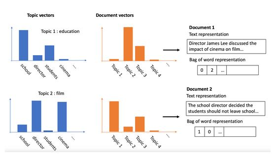

### Types of useful text data
1. Emails from employees and/or clients
2. Descriptions of bank transcations
3. Employee notes
4. Insurance claims form description box
5. Recorded telephone conversations


### Text mining techniques for fraud detection
- When using text data in fraud analysis, there are multiple ways to use the data.
1. **Word search** : A common application is a word search, to flag any data mentioning certain terms.
2. **Sentiment Analysis** : measuring how positive or negative a text is can be combined with word search. We can check whether text data associated with fraud tends to be more negative or positive relative to the normal text. 
3. **Word frequencies and topic analysis** : Topic analysis and counting the frequency of certain words of interest, is another powerful application for fraud detection.
4. **Style** : Analyze the style of text data and search for text that is similar in style to flag for fraud.

#### Word search for fraud detection
- **Flagging suspicious words** : Suppose we want to flag all client transcations that mention a certain gambling company, as this company has received bad press lately. A simple word search on all transcations and client emails can easily filter whether any of the clients mention this company.
- We can then use this result as a filter, or a flag on its own, or simply as an additional feature in our ML model.

#### Word counts to flag fraud with pandas
- Pandas has functions that allow us to do operations on text data within a pandas series or dataframe. Here we use `str.contains` function to find all rows that contain the word **money laundering**.

```python
# using a string operator to find words
df['email_body'].str.contains('money laundering')

# select data the matches
df.loc[df['email_body'].str.contains('money laundering', na=False)]

# the need to use na=False is to ignore all rows containing missing values, otherwise the indexer won't work.

# create a list of words to search for
list_of_words = ['police', 'money laundering']
df.loc[df['email_body'].str.contains('|'.join(list_of_words), na=False)] 

# we need to join the list of words with the "or" command 

# create a fraud flag
df['flag'] = np.where((df['email_body'].str.contains('|'.join(list_of_words)) == True), 1 ,0)
```

### More Text mining techniques

#### Cleaning our text data
- Whenever we work with text data, be it for word search, topic modelling, sentiment analysis or text style, we need to do some rigorous text cleaning in order to be able to work with the data.
- Must do's when working with textual data
1. **Tokenization** and lowercase with puncutation removing
2. Remove all **stopwords** as they mess up our data
3. **Lemmatize words** : chaning words from third person into first person, changing verbs in past and future tenses into present tenses. This allows us to combine all words that points to the same thing.
4. **Stem words** : reduce words to their root form. For e.g walking and walk

#### Data preprocessing part 1

```python
# 1. Tokenization
from nltk import word_tokenize

text = df.apply(lambda row:word_tokenize(row['email_body']), axis=1)
text = text.rstrip()  # remove whitespaces
text = re.sub(r'[^a-zA-Z]', ' ', text) # lowercasing using re

# 2. Remove all stopwords and punctutaions
from nltk.corpus import stopwords
import string

exclude = set(string.punctuation)
stop = set(stopwords.words('english'))
stop_free = " ".join([word for word in text if ((word not in stop) and (not word.isdigit()))])
punc_free = " ".join(word for word in stop_free if word not in exclude)
```

#### Data preprocessing part 2

```python
# Lemmatize words
from nltk.stem.wordnet import WordNetLemmatizer
lemma = WordNetLemmatizer()
normalized = " ".join(lemma.lemmatize(word) for word in punc_free.split())

# Stem words
from nltk.stem.porter import PorterStemmer
porter = PorterStemmer()
cleaned_text = " ".join(porter.stem(token) for token in normalized.split())
```

### Topic modelling on fraud

#### Topic modelling : discover hidden patterns in text data
1. Topic modelling can be a powerful tool when searching for fraud in text data.
2. Topic modelling allows us to **discover abstract "topics"** that occur in a collection of documents.
3. Intutively, given that a document is about a particular topic, one would expect particular words to appear in the document more or less frequently.
4. Topic modelling therefore tells us in a very efficient way **what the text is about**, based on the words it contains.
5. **Conceptually it is similar to clustering, as it clusters words belonging to the same topic together**.
6. If we have text data of known fraud cases, it allows us to check what are the most common topics for those fraud cases and use that to compare unknown cases. In other words, **compare topics for those fraud cases and use that to compare unknown cases**.
7. Without known labels, we can inspect which topics seem to point to fraudulent behaviour and are interesting to further investigate.

#### Latent Dirichlet Allocation (LDA)
1. LDA is an example of topic model and is commonly used.
2. LDA creates a **"topic per text item"** model and **"words per topic"** model, which are called **Dirichlet distributions**.

#### Creating our own topic model
1. Clean the data
2. Then, create a dictionary containing which words appear how often in all of the text.And also a corpus, containing for each text line in our data the count of words that appear. -> **Create a bag of words** with dictionary and corpus.

#### LDA
- The results that we get from this model are two fold:
1. First we see how each **word** in our total data is associated with each topic.
2. Second, we can also see how each text item in our data associates with topics, also in the form of probabilities.



### Implementing LDA with gensim, Bag of words : dictionary and corpus

```python
from gensim import corpora

# use Dictionary function in corpora to create a dictionary from a text data, in this case cleaned emails.

# create dictionary of number of times a word appears
dictionary = corpora.Dictionary(cleaned_emails)

# filter out non frequent words : filter out words that appear in less than 5 emails and keep only the 50000 most frequent words, in a way of cleaning out the outlier noise of the text data.
dictionary.filter_extremes(no_below=5, keep_n=50000)

# create a corpus that tells us for each email how many words it contains and how many times those words appear
# Doc2bow stands for "document to bag of words". This function converts text data into bag-of-words format. That means each row in our data is now a list of words with their associated word count.
corpus = [dictionary.doc2bow(text) for text in cleaned_emails]
```

1. After cleaning the text data, and creating dictionary and corpus, we are now ready to run our LDA model.
2. We need to pass the corpus and dictionary into the LDA model.
3. As with k-means, we need to pick the number of topics we want to obtain beforehand, even if we're not sure yet what the topics are.
4. The LDA model calculated here, now contains the associated words for each topic, and the topic scores per email.
5. We can obtain the top words from the three topics with the function **"print_topics"** 
6. After running the model, we print the 3 topics and the four top keywords associated with the topic, for interpretation of results

```python
import gensim

# define the LDA model
ldamodel = gensim.models.ldamodel.LdaModel(corpus, num_topics=3, id2word=dictionary, passes=15)

# print the 3 topics from the model with top words
topics = ldamodel.print_topics(num_words=4)
for topic in topics:
    print(topic)
```

### Flagging fraud based on topics

#### Using LDA model results for fraud detection
- If we don't have labels, we can first check for frequency of suspicious words within topics and check whether topics seem to describe the fraudulent behaviour.
- For the Enron email data, a suspicious topic would be one where employees are discussing stock bonuses, selling stock, the Enron stock price, and perhaps mentions of accounting or weak financials.
- Defining suspicious topics does require some pre-knowledge about the fraudulent behaviour. If the fraudulent topic is noticeable, we can flag all instances that have a high probability for this topic.
- If we have previous cases of fraud, we can run a topic model on the fraud text only, as well as on the non-fraud text. Check whether the results are similar i.e whether the frequency of topics are the same in fraud versus non-fraud.
- Lastly, we can check whether fraud cases have a higher probability score for certain topics. If so, we can run a topic model on the new data and create a flag directly on the instances that score high on those topics.

#### To understand topics, we need to visualize
- Interpretation of the abstract topics can sometimes be difficult, so we need good visualization tools to dive deeper and try to understand what the underlying topics mean.
- There is a visualization tool called `pyLDAvis` for gensim available, that does an excellent job. Be minfull though, this tool only works with Jupyter notebooks. Once we have created our model, we can create a detailed visualisation in just 2 lines of code.

```python
import pyLDAvis.gensim

lda_display = pyLDAvis.gensim.prepare(ldamodel, corpus, dictionary, sort_topics=False)

pyLDAvis.display(lda_display)
```

#### Interpreting the output
- Each bubble on the left-hand side represents a topic. The larger the bubble, the more prevalent that topic is. We can click on each topic to get the details per topic in the right panel.
- The words are the most important keywords that form the selected topic. A good topic model will have fairly big, non-overlapping bubbles scattered throughout the chart.
- A model with too many topics, will typically have many overlaps, or small sized bubbles clustered in one region. In our case, there is a slight overlap between topics 2 & 3, so that may point to 1 topic too many.

#### Practical application : Assign topics to original data
- One of the practical application of topic modelling is to determine what topic a given text is about. *To find that, we need to find the topic number that has the highest percentage contribution in that text*. 
- The below function nicely aggregates this information in a presentable table.

```python
def get_topic_details(ldamodel, corpus):
    topic_details_df = pd.DataFrame()
    for i, row in enumerate(ldamodel[corpus]):
        row = sorted(row, key=lambda x: (x[1]), reverse=True)
        for j, (topic_num, prop_topic) in enumerate(row):
            if j == 0:  # => dominant topic
                wp = ldamodel.show_topic(topic_num)
                topic_details_df = topic_details_df.append(pd.Series([topic_num, prop_topic]), ignore_index=True)
    topic_details_df.columns = ['Dominant_Topic', '% Score']
    return topic_details_df
```

- Function can be applied as follows:

```python
contents = pd.DataFrame({'Original text':text_clean})
topic_details = pd.concat([get_topic_details(ldamodel,
                           corpus), contents], axis=1)
topic_details.head()
```

- **Result** : Each row contains the dominant topic number, the probability score with that topic and the original text data.


